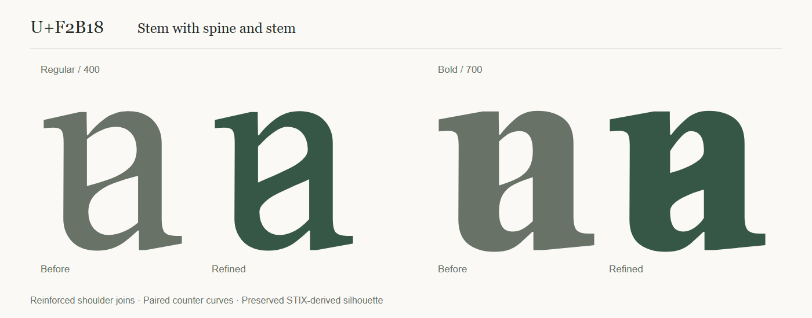

# U+F2B18 optical design and project mark

U+F2B18 **stem with spine and stem** is the project emblem. This is an unpublished
optical revision of the 0.220 Roman reference, across weights 400–700. Its stable
identity is `opposed-bowls-0-0`, with historical internal glyph name `uF2B1C`.

## Construction and decisions

The pinned STIX Two Text 2.13 b171 supplies the design reference: `b` establishes
shaft dimensions and the upper shoulder, `p` supplies the left head, `ɑ` supplies
the right foot, and `a`/`ɐ` establish opposing bowl proportions and stress.

The original upper shoulder was fitted independently from its counter. Their
distance narrowed markedly at the left attachment. The two independently
borrowed counters also made a very thin shared diagonal, particularly in Bold.
The revised counters are designed together within the original outer contour.
The central spine follows two coordinated, flowing curves. Its thickness varies
gently, with enough contrast to sit comfortably beside STIX's native letters
and enough consistency to avoid a visibly pinched middle.

| Region | Optical decision |
| --- | --- |
| Left head and bracket | Retain the STIX rising serif, bracket, terminal angle, and native taper into the upright. |
| Left and right shafts | Retain their native widths, verticality, exterior curves, and bearings. |
| Upper-left connection | Lower and reshape the counter's return to support the branch under the rising shoulder. |
| Upper bowl | Retain the native counter extremum and horizontal/vertical tangents; avoid flattening the crown. |
| Shared spine | Balance the normal distance between paired curved edges; ease the entrances and retain subtle modulation through the middle. |
| Lower bowl | Use the corresponding opposing curve and retain the native lower turn and overshoot. |
| Lower-right connection | Balance support against the upper connection, with relief adapted to the alpha-derived foot. |
| Right foot and bracket | Retain the native sweep, serif thickness, terminal, and baseline treatment. |

Quadratic point economy is part of the design. The paired curves are converted
together with a maximum quarter-unit approximation error before compilation.
This avoids long sequences of tiny segments whose integer-rounded controls can
produce visible ripples. The Regular/Bold topology remains compatible.

The variable-font build also retains explicit source-derived variation deltas
for the outer contour. A counter edit otherwise changes the compiler's sparse
delta packing and can slightly move unchanged exterior points between weights.
This keeps the original silhouette exact throughout the axis.

The unrounded design's shared spine measures approximately 62–69 units in
Regular and 93–101 in Bold, measured perpendicular to its edges. Its modest
variation maintains a curved, calligraphic character without the former waist.
The Bold handles are adjusted independently to keep the tighter counters open.
Native shaft intersections widen naturally where the strokes merge; they are
not treated as a constant-width band. Compiled measurements across the weight
axis are recorded below, independently of the design's control points.

## Scope and assets

The refinement applies to this reviewed Roman construction. Its code point,
advance widths (526 Regular / 569 Bold), outer contour, bearings, and kerning
remain preserved. Other character outlines and all native Italic forms retain
their original geometry. The related forms remain candidates for individual
optical review; this emblem is not a claim that the repertoire is finished.

The Regular outline is exported directly from the compiled cmap into
`site/assets/project-icon.svg` and `site/assets/favicon.svg`. These are outlined
vectors, independent of installed fonts and specimen weight/posture controls.
The mark appears in the site header, introduction, browser favicon, and README.
The downloadable font formats and the affected PDF charts are rebuilt together.

## Verification

The dedicated `tools/test_project_glyph.py` suite measures filled outlines
independently of the construction recipe. It compares shoulder and spine widths
against the pinned STIX `b` shoulder and `o` hairline/stem, checks counter
topology and stroke-width continuity, and checks exact exterior preservation at
seven weights: 400, 450, 500, 550, 600, 650, and 700.

Stroke measurements use normals to the filled boundaries rather than vertical
gaps, which overstate diagonal thickness. The shared middle band is assessed
separately from the final merges into the native shafts.

Recorded evidence:

- [Optical measurements](../resources/verification/project-glyph.json)
- [Source and compiled preservation](../resources/verification/f2b18-preservation.json)
- [Explicit revision hashes](../resources/provenance/f2b18-optical-revision.json)
- [Isolated repeat build](../resources/provenance/f2b18-repeat-build.json)
- [Website and small-size review](../resources/verification/f2b18-browser-review.json)
- [Updated PDF review](../resources/verification/f2b18-pdf-review.json)

Final validation passed four dedicated optical checks, the four affected primary
checks (source compatibility, opposed bowls, WOFF2 tables, and proof/manifest
metadata), ten complete static/variable preservation comparisons, and exact
source/identity verification. The isolated build reproduced all sixteen
manifested outputs and the manifest byte for byte. Website validation passed
16 naming tests, 11 site groups, and 76 browser checks; all six PDF checks passed.

Large outline proofs were reviewed against STIX donors, followed by native
STIX neighbor proofs at 16/20/24/36-pixel em sizes and 120-pixel controls. The
16/24/32/64 CSS-pixel icons and text were reviewed at standard and high densities.
The homepage was inspected at desktop and mobile widths. Automated verification
and agent visual inspection are separate from user visual acceptance.
