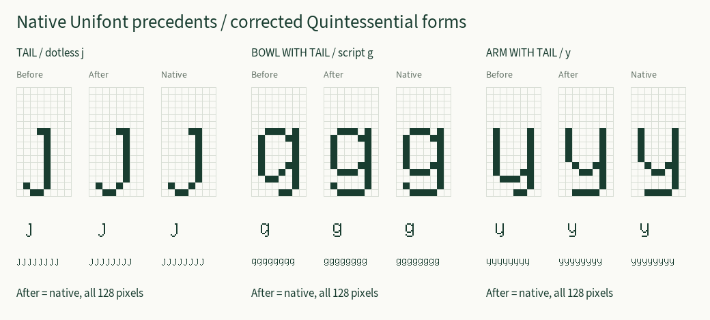

# Native tail and hook revision

The 2026-09-06 correction changes 417 of the 1,216 Quintessential Latin bitmaps:
all 305 forms with a curved lower ending and 112 additional forms with the
inconsistent compact upper hook. The other 799 bitmaps are unchanged, including
all lower long-bowl returns and their immediate-neighbor closure masks.

`tail` exactly matches U+0237 DOTLESS J, `turned-bowl-tail` exactly matches
U+0261 SCRIPT G, and `turned-arch-tail` exactly matches U+0079 Y. Each match
covers all 128 pixels. The three tail primitives follow dotless j's native
column-5 axis; unrelated primitives retain their original geometry.

The donors came from the project's pinned
[official GNU Unifont 17.0.05 HEX archive](https://unifoundry.com/pub/unifont/unifont-17.0.05/font-builds/unifont-17.0.05.hex.gz).
Both compressed and decompressed archive hashes were verified before adding y
and script g to `donors.hex`. The installable font adds native script g to its
companion set; the existing 213 companion drawings remain unchanged.

## Context and preservation

Bowl, double-bowl and spine endings use script g's shorter lower bowl and
upturned return. Lower arms and hips use y's contracted lower join and tipless
return. Compact forms fit the same context into the final component's bay;
shared joins remain explicit. Extending a middle leg next to the shortened
bowl adds its documented row-13 bridge. An adjacent extended stave can close a
small terminal counter, separately from the body counters.

Long open bowls beneath an upper arch retain the tipless return. Adding an
upturned left tip there would close the bowl against a short stem. Existing
upper long-bowl shapes and their adjacent-only closure also remain unchanged.

Ordinary upper hooks use the translated native f crest consistently. If an
extended adjacent arm occupies the same pixel as the old hanging tip, that
independently required pixel stays. This explains why some source masks change
without changing their rendered bitmap.

`before.hex` preserves the complete pre-change repertoire. `../tail-revisions.json`
records every changed glyph's exact before/after HEX line and changed coordinates.
The builder rejects unlisted changes, mismatched revisions and changed historical
approval bytes. The historical 148-glyph approval file itself is unchanged.

## Inspection and validation

All 18 `changes-*.png` sheets were visually inspected: sheets 01–06 cover
144 cells, sheets 07–12 cover 144, and sheets 13–18 cover 129. The grids include
both the original and corrected pixels plus native-size runs. Three reviewers
checked the complete changed set for broken joins, clipping, counter damage
and inconsistent endings. No additional correction was required.

`proof-manifest.json` binds every sheet to its exact image hash and the current
HEX hash. The 417 revised drawings have current inspection records in
`../review.json`. Unchanged drawings retain their historical presentation
records and proof hashes; this focused revision does not claim a new full-site
presentation review for those records. User aesthetic acceptance remains separate.

Validation completed:

- The three source generators reproduce their checked-in JSON exactly.
- The 20 bitmap regression tests pass, including native donor equality, all
  1,216 preservation comparisons, independent pairs/quartets, joining pixels,
  long-bowl closure, uniqueness, topology and current inspection bindings.
- `npm test` passes the allocation, naming, UCD, bitmap and 19 site acceptance
  groups; the site build passes.
- All six compiled-font tests pass for TTF and WOFF2, including every outline,
  every embedded bitmap, native FreeType rasterization and byte-identical rebuilds.
- Browser font tests pass both downloads, desktop/mobile layout and all 2,860
  exact native-size font renderings (1,430 characters in each format).
- All 2,484 chart-browser checks pass, with 1,216 individual proof captures,
  desktop/mobile layouts and all 42 donor cards accessible without JavaScript.
  The current report is `../browser-verification.json`.

See `independent-audit.md` for the donor audit and the deliberate non-tail
alpha-based bowl construction that was preserved.
